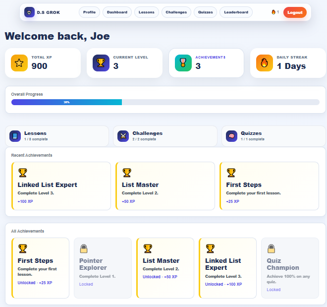
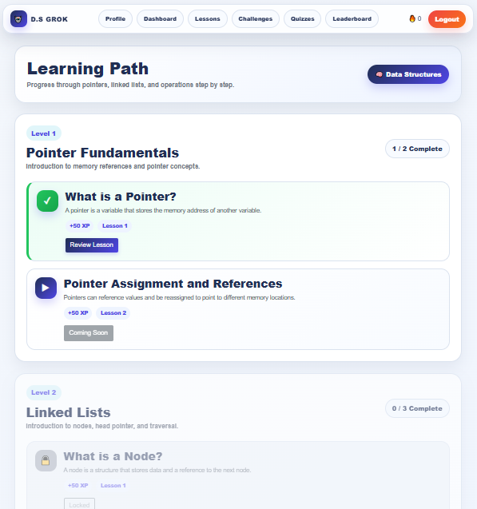
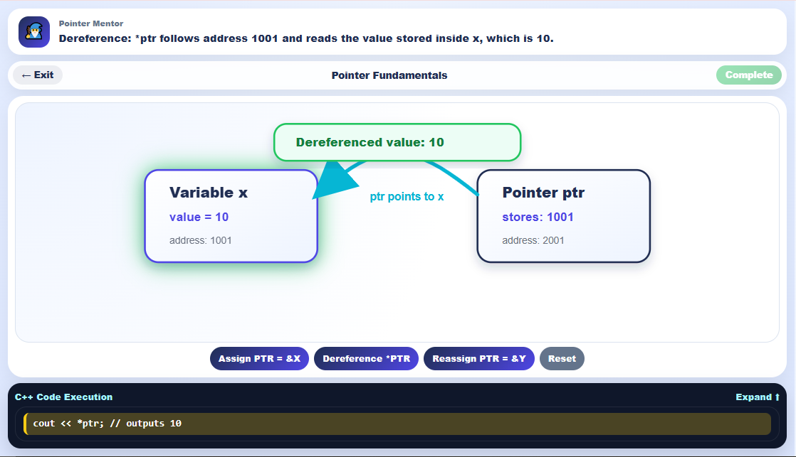
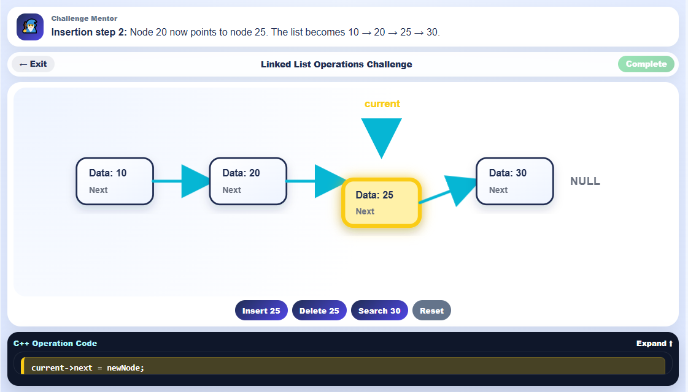
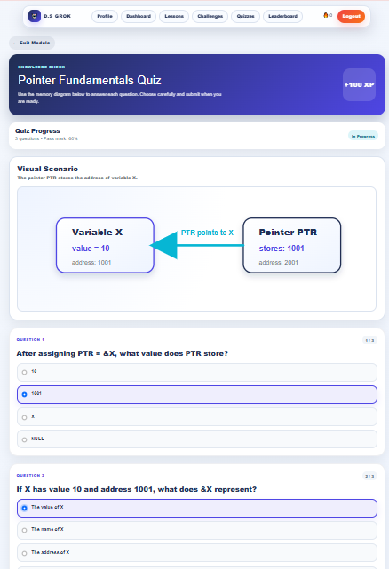
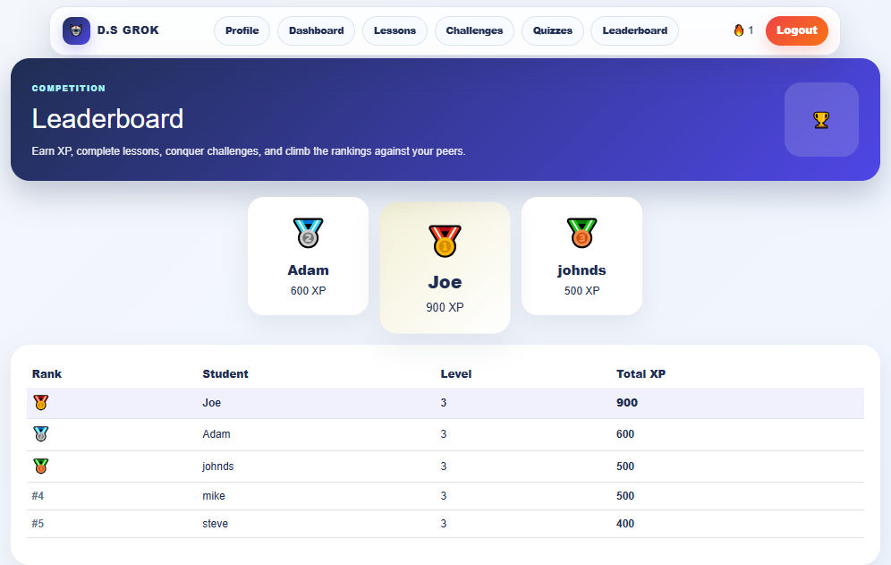

# D.S-Grok 🎮

### Game-Based Learning for Data Structures

D.S-Grok is a web-based educational application developed as my Bachelor of Science in Computer Science senior project.

It was designed to help university students understand data structure concepts through **interactive visualisations, lessons, quizzes, challenges, and gamification**.


---

## 📸 Preview



---

## 🚀 Features

- Interactive lessons for core data structure concepts
- Visual learning activities
- Quizzes with progress tracking
- Coding and logic challenges
- XP-based progression system
- Achievements and rewards
- User progress tracking
- Leaderboard
- Session-based user authentication
- Relational database integration

---

## 🛠️ Tech Stack

**Backend**

- C#
- ASP.NET Core MVC
- .NET 8
- Entity Framework Core

**Frontend**

- HTML
- CSS
- JavaScript
- Razor Views

**Database**

- MySQL

**Development Tools**

- Visual Studio Code
- Visual Studio
- MySQL Workbench
- Git
- GitHub

---

## 🏗️ Architecture

The application follows the ASP.NET Core MVC architecture.

```text
User
  │
  ▼
Views / Razor Pages
  │
  ▼
Controllers
  │
  ▼
Services / Business Logic
  │
  ▼
Entity Framework Core
  │
  ▼
MySQL Database
```

🎮 Main Modules
Lessons

Interactive learning content designed to explain data structure concepts step by step.

Quizzes

Knowledge-check quizzes allow users to test their understanding and track their progress.

Challenges

Interactive challenges allow users to apply the concepts introduced during the lessons.

Gamification

The application includes several gamification elements:

XP
Levels
Achievements
Progress tracking
Leaderboard ranking

These features were introduced to encourage engagement and progression through the learning material.

📚 Educational Focus

The implemented learning content focuses primarily on:

Pointer concepts
Linked Lists
Linked List Traversal
Linked List Operations

The application combines interactive visualisation with game-based learning techniques to make abstract data structure concepts easier to understand.

🔐 Authentication

D.S-Grok uses a custom session-based authentication system built with ASP.NET Core session management.

ASP.NET Identity was not used in this project.

🗄️ Database

The application uses MySQL with Entity Framework Core for data access.

The database supports application data related to areas such as:

Users
Lessons
Quizzes
Challenges
Progress
Achievements
XP
Levels
Leaderboard activity

Entity Framework Core migrations are included in the repository to represent the database structure.

⚙️ Running the Project
Requirements
.NET 8 SDK
MySQL Server
Visual Studio or Visual Studio Code
Setup
Clone the repository.
Configure a local MySQL connection string in appsettings.json.
Restore the .NET dependencies.
Apply the included Entity Framework Core migrations.
Run the application.

Database credentials and machine-specific configuration are intentionally excluded from the public repository.

🎓 Project Context

D.S-Grok was developed as my Computer Science senior project.

The project combined several areas of software development and computing, including:

Full-stack web development
Database design
Human-computer interaction
Game-based learning
Educational technology
Data structure visualisation

## 📸 Screenshots

### Dashboard


### Learning Path



### Interactive Lesson



### Challenge



### Quiz



### Leaderboard



📌 Project Status

D.S-Grok was completed as a senior-project MVP.

The application demonstrates the core learning, quiz, challenge, visualisation, progress-tracking, and gamification functionality developed for the project.

👤 Author

Joe Zeinaty

Computer Science Graduate
Junior Software Developer

GitHub: joe-zeinaty
